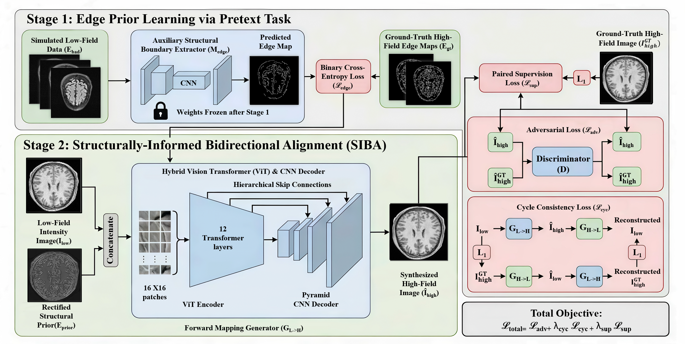

# Structurally-Informed Bidirectional Alignment for High-Quality MRI Reconstruction

[](https://www.python.org/downloads/release/python-3100/)
[](https://pytorch.org/)
[](https://opensource.org/licenses/MIT)

> 🚀 A deep learning framework for high-field MRI synthesis.





---

## 📖 Table of Contents
- [Abstract](#abstract)
- [Installation](#installation)
- [Dataset Preparation](#dataset-preparation)
- [Usage](#usage)
- [Model Architecture](#model-architecture)
- [Results](#results)


---

## 🧠 Abstract
High-field Magnetic Resonance Imaging (MRI) offers superior diagnostic capabilities but is often constrained by high costs and infrastructure demands, whereas accessible low-field MRI frequently suffers from limited resolution and noise artifacts. However, existing deep learning approaches for synthesizing high-quality images are often hindered by a trade-off between over-smoothed textures resulting from pixel-wise losses and structural hallucinations inherent to standard generative adversarial paradigms.

To address these limitations, we propose the **Structurally-Informed Bidirectional Alignment (SIBA)** framework. The methodology commences with the pre-training of an auxiliary structural boundary extractor on the diverse fastMRI dataset to capture robust high-frequency anatomical cues. Upon capturing these structural priors, the frozen module is integrated into a cyclic domain adaptation architecture to guide synthesis on paired Human Connectome Project (HCP) data, thereby explicitly enforcing geometrical consistency while synthesizing realistic high-field textures. 

Comprehensive evaluations demonstrate that SIBA effectively balances visual realism with anatomical fidelity, achieving superior performance.

---

## ⚙️ Installation

Clone the repository:
```bash
git clone https://github.com/xxx.git
```
Install the required packages:
```bash
pip install -r requirements.txt
```
---

## 📂 Dataset Preparation
To ensure robust generalization and prevent gradient contamination, our framework utilizes two distinct datasets for the two-stage training paradigm:

Pre-training Dataset (fastMRI): NYU fastMRI Dataset is used to pre-train the Edge Extractor.

Synthesis Dataset (HCP): Human Connectome Project (Young Adult) is used for the bidirectional alignment generator.

Data Structure:
Please prepare your datasets in .npz format.The directory should be organized exactly as follows:
```bash
datasets/
├── fastMRI/                
│   
└── HCP_Paired/             
    ├── train/
    │   ├── A/ (Low-field)
    │   └── B/ (High-field)
    └── final_test/
        ├── A/
        └── B/
```

---

## 🚀 Usage
Unlike traditional end-to-end models, SIBA utilizes a decoupled two-stage training strategy to firmly anchor anatomical structures.

Stage I: Train the Edge Extractor (on fastMRI)
First, pre-train the auxiliary structural boundary extractor to learn domain-invariant anatomical priors via a pretext task.
```bash
python train_edge_repair.py
```
Stage II: Train the SIBA Generator (on HCP)
With the boundary extractor completely frozen, train the primary bidirectional mapping network to synthesize high-field textures.

```bash
python train.py
```
Testing & Inference
To generate synthetic high-field MRIs using the test set:

```bash
python test.py
```

---

## 🏗 Model Architecture

The SIBA framework uses a decoupled "Structure-First, Texture-Next" approach in two stages. 

Stage 1 pre-trains a structural boundary extractor to capture robust anatomical edge priors, then freezes its weights to prevent gradient contamination. 

Stage 2 fuses the low-field input with these structural priors using a generator with a 12-layer Vision Transformer (ViT) encoder and a pyramid CNN decoder. This setup captures both global context and local details. 

The framework is optimized with paired supervision, adversarial, and cycle-consistency losses, ensuring realistic high-field MRI textures while maintaining strict anatomical accuracy.

---

## 📊 Results
Experiments demonstrate that SIBA effectively resolves the perception-distortion trade-off, achieving superior performance with an FID of 2.75, a PSNR of 26.23 dB, and an SSIM of 0.881. Our framework successfully synthesizes highly realistic high-field MRI textures while strictly preventing structural hallucinations.

---

## 📜 License
This project is licensed under the **MIT License**.